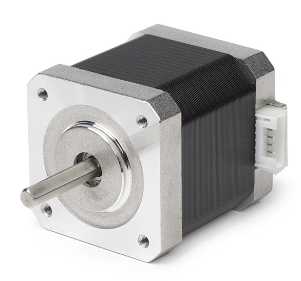
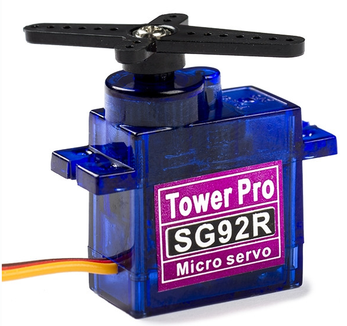
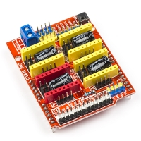
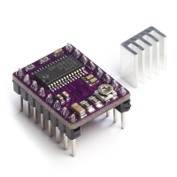

# Automatic-Wire-Cutter

## PARTS

[Stappenmotor](https://www.123-3d.nl/123-3D-NEMA17-stappenmotor-1-8-graden-per-stap-48-mm-lang-4-8-kg-cm-SL42S248A102-0524-i3422-t14804.html)

[Servomotor](https://www.123-3d.nl/search/?search=servo)

[Arduino CNC shield](https://www.123-3d.nl/123-3D-Arduino-CNC-shield-v3-grbl-compatible-i1991-t12883.html)

[Stappenmotordriver](https://www.123-3d.nl/123-3D-Stepstick-DRV8825-stappenmotordriver-i96-t332.html)

[ESP example code](https://os.mbed.com/teams/mbed-os-examples/code/mbed-os-example-mbed5-wifi/)

[Tang](https://www.amazon.nl/Cutter-Kabel-Stripper-Elektrische-Elektricien-Handgereedschap/dp/B08SBY64J1/ref=sr_1_10?__mk_nl_NL=%C3%85M%C3%85%C5%BD%C3%95%C3%91&crid=1G7WO3J83OX59&keywords=stripper+and+cutter&qid=1645606617&sprefix=stripper+and+cutter%2Caps%2C90&sr=8-10)