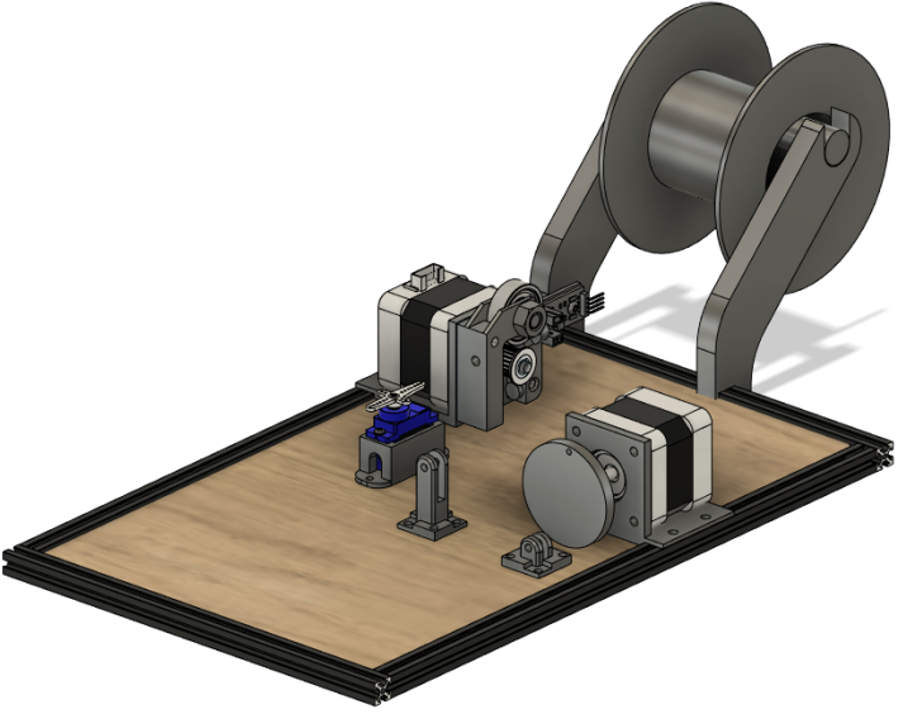

# Automatic-Wire-Cutter

Michiel Depraetere | Mark De Craemere | Axel Broeckert | Quinten Transé


## PARTS

### Electronic implementation

We use the following steppermotor for the cablefeeder as well as for the motor that drives the pliers:

[Steppermotor](https://www.amazon.nl/gp/product/B08RB5F9RW/ref=ox_sc_act_title_1?smid=A3MWTOW3Y5FBF1&psc=1)


The microcontroller that is used in the project is a NUCLEO WB55RG:


This is the shield with drivers implemented on it:


### Mechanical design

The frame is made out of maker beams, the other mechanical parts are 3D-printed.



These are the pliers to cut and strip the cable:


### Website

This is the interface of the website:


### Communication

The communication between the website and the NUCLEO is via Bluetooth Low Energy.

## Setup

To get this repository, go to a local file directory and execute the following command:

```bash
git clone git@github.com:vives-projectweek-2022/Automatic-Wire-Cutter.git
```

To compile the program on a NUCLEO use the following command:

```bash
conda activate mbed
mbed target detect
mbed compile -f --sterm --baudrate 115200
```
